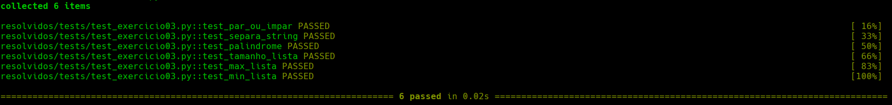

# Aulas de python  
### Exercícios com testes para estudos  


* Os exercícios a fazer estão na pasta exercicios  
* Os testes para seus exercícios estão na pasta tests
* Os exercícios resolvidos estão na pasta resolvidos/exercicios, só olhe em último caso ; )  
* Os testes para os exercícios resolvidos estão na pasta resolvidos/tests  

### Como utilizar
No terminal, clone o repositório
```
git clone git@github.com:amaurirg/aulas-python.git
```
Acesse a pasta do repositório
```
cd <pasta_do_repositorio>
```  
Crie uma branch, com nome de sua preferência, a partir da branch master para fazer seus exercícios
```
git checkout -b <nome_da_branch>
```

Instale as dependências
~~~python
pip install -r requirements.txt
~~~

Faça os exercícios conforme as instruções nas funções
~~~python
def par_ou_impar(numero):
    """ Deve retorna PAR ou IMPAR apenas """
    # Seu código aqui
    pass
~~~

Para rodar todos os testes no terminal
~~~python
pytest
~~~

Para rodar apenas um teste no terminal. No exemplo rodará apenas o test_exercicio03
~~~python
pytest resolvidos/tests/test_exercicio03.py -v
~~~

A opção -v serve para mostrar os nomes dos testes



